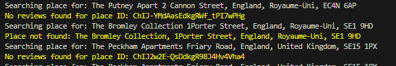

# Flex Living Reviews Dashboard

## Live Demo

- **Manager Dashboard:** [https://flex-delta-orcin.vercel.app/](https://flex-delta-orcin.vercel.app/)
- **Example Listing Details:** [https://flex-delta-orcin.vercel.app/dashboard/listing/155613](https://flex-delta-orcin.vercel.app/dashboard/listing/155613)
- **Example Public Review Page:** [https://flex-delta-orcin.vercel.app/property/155613](https://flex-delta-orcin.vercel.app/property/155613)

**How to use:**

- The app opens directly to the Manager Dashboard, where you can view all property listings (the ones retrieved from the sandbox hostaway API) and their review stats.
- To view the public property review display page for a specific listing, click **View Full Property Details** on any listing report.
- Only reviews approved by the manager are shown on the public page.

## Tech Stack

- **Frontend:** Next.js, React, TypeScript
- **Backend:** Next.js, Node.js, Supabase
- **APIs:**
  - Hostaway Reviews API
  - Google Places API
- **AI Tool Used:** GitHub Copilot (GPT-4.1, Claude Sonnet 4.5), Perplexity

## Key Features & Design Decisions

- **Hostaway Integration:**

  - Mocked Hostaway API for review data.
  - Relying on 3 usecases to fetch review data
    - [GetMockReviews](./src/application/use-cases/GetMockReviews.ts)
    - [GetReviewsFromHostAway](./src/application/use-cases/GetReviewsFromHostAway.ts)
    - [GetReviewsFromGoogle](./src/application/use-cases/GetReviewsFromGoogle.ts)
  - Fetching Listings from HostAway API : [GetListingsUseCase](/src/application/use-cases/GetListingsUseCase.ts)

- **Google Reviews Integration:**

  - Integrated via Google Places API.
  - Attempting to fetch reviews from the listings mentioned in the sandbox environment, however no reviews are found for these listings
    

- **Manager Dashboard:**
  - Displays property listings provided by the sandboxed Hostaway API.
  - Managers can approve reviews for public display.

## API Behaviors

- **GET `/api/reviews/hostaway`**

  - `/api/reviews/hostaway` returns normalized, structured review data for frontend use.
    - **Query Parameters:**
      - `listingMapIds` (comma-separated numbers): Filter by listing IDs. Example: `listingMapIds=123,456`
      - `limit` (number): Limit the number of reviews returned.
      - `offset` (number): Offset for pagination.
      - `type` ('guest-to-host' | 'host-to-guest'): Filter by review type. Only valid values allowed.
      - `statuses` (comma-separated, allowed: 'awaiting', 'pending', 'scheduled', 'submitted', 'published', 'expired'): Filter by review status. Only valid values allowed.
    - **Response Model:**
      ```json
      {
        "status": "success",
        "data": [
          {
            "id": 123,
            "type": "guest-to-host",
            "status": "published",
            "rating": 4.5,
            "publicReview": "Great stay!",
            "reviewCategory": [
              { "category": "cleanliness", "rating": 5 },
              { "category": "location", "rating": 4 }
            ],
            "submittedAt": "2025-12-14T00:00:00.000Z",
            "guestName": "John Doe",
            "listingName": "Cozy Apartment",
            "listingMapId": 123,
            "channel": "Airbnb"
          }
        ],
        "count": 1
      }
      ```

- **GET `/api/reviews/google`**
  - Returns normalized Google Places reviews for a property, if a matching place is found.
    - **Query Parameters:**
      - `listingId` (number, optional): The unique ID for the listing. If not provided, a random ID is generated for the request.
      - `listingName` (string, required): The name of the property/listing to search for in Google Places.
      - `listingAddress` (string, required): The address of the property/listing to search for in Google Places.
    - **Response Model:**
      ```json
      {
        "status": "success",
        "data": [
          {
            "id": 123456,
            "type": "guest-to-host",
            "status": "published",
            "rating": 4.5,
            "publicReview": "Great location and friendly host!",
            "reviewCategory": [],
            "submittedAt": "2025-12-14T00:00:00.000Z",
            "guestName": "Jane Smith",
            "listingName": "Cozy Apartment",
            "listingMapId": 123456,
            "channel": "Google"
          }
        ],
        "count": 1
      }
      ```
    - **Error Responses:**
      - If `listingName` or `listingAddress` is missing:
        ```json
        {
          "status": "error",
          "message": "listingName and listingAddress are required query parameters."
        }
        ```
      - If no Google reviews are found, `data` will be an empty array.
    - **Notes:**
      - If a property cannot be matched in Google Places, the response will contain no reviews, but the request will not fail.
      - This endpoint is used by the dashboard to supplement Hostaway reviews with public Google reviews where available.

## Google Reviews Findings

- The Google Places API can be used to fetch public reviews for properties if the place can be matched by name and address.
- Integration is implemented where feasible. If a property cannot be matched, the dashboard gracefully handles the absence of Google reviews.

## Local Setup Instructions

1. **Clone the repository:**
   ```bash
   git clone <your-repo-url>
   cd flex
   ```
2. **Install dependencies:**
   ```bash
   npm install
   ```
3. **Set environment variables:**
   - Create a `.env.local` file with your API keys:
   - Check env.local.example
4. **Run the development server:**
   ```bash
   npm run dev
   ```
5. **Open the app:**
   - Visit [http://localhost:3000](http://localhost:3000) in your browser.
